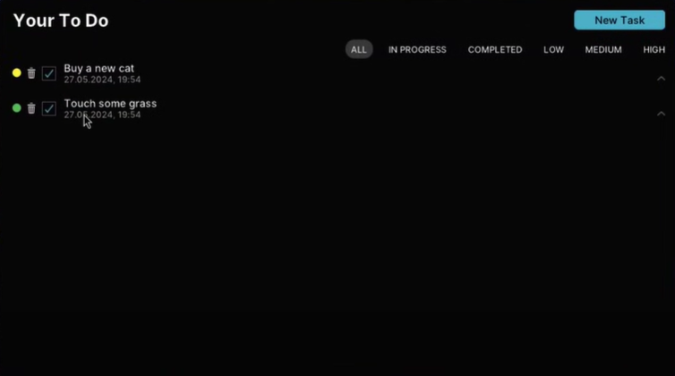

## Yggdrasil
###### *
// Overview
*
Yggdrasil Tasks is a feature-rich to-do application developed using pure C. With a clean and intuitive interface, along with a range of useful features to streamline your productivity, this tool is designed to help you stay organized and on top of your daily tasks.

###### *
// Screenshot
*

  
  
 Yggdrasil 

## License
Yggdrasil is licensed under the [MIT License](../LICENSE).
