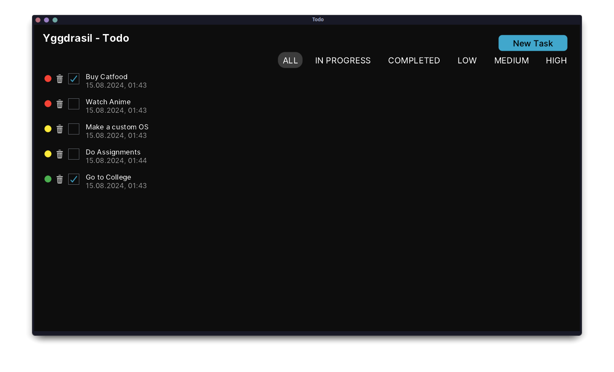

## Yggdrasil
###### *<div align="right"><sub>// Overview</sub></div>*
_Yggdrasil_ is a everyday to-do application written in C. With a clean and intuitive interface, along with a range of useful features to streamline your productivity.

It supports _serialization & deserialization_ of tasks. Furthmore, the app implements a _priority system_ for your tasks and the displayed tasks are sorted from high to low priority. There is also a _filtering system_ that filters tasks after different critia (eg. completed, high priority,in progress).

###### *<div align="right"><sub>// UI Library</sub></div>*
The UI of the applicaton is written with the [leif](https://github.com/cococry/leif) UI library which is a small immediate mode UI framework that is written in C and made by [cococry](https://github.com/cococry).

###### *<div align="right"><sub>// Screenshot</sub></div>*
<div align="center">

  <a>
    
  </a>
  <p> Yggdrasil (TODO) </p>
</div>

>[!IMPORTANT]
> Application only supports Linux and MacOS.

### Development or Running the Application
###### *<div align="right"><sub>// Prerequisites</sub></div>*
```bash
sudo pacman -S gcc glfw glew cglm # Arch Linux
yay -S libclipboard-git

git clone https://github.com/cococry/leif # Clone leif (UI Library)
cd leif
make -j$(nproc) && sudo make install
cp -rf ./.leif ~/
```
###### *<div align="right"><sub>// Build</sub></div>*
```bash
gcc -o todo yggdrasil.c -lleif -lglfw -lm -lGL -lclipboard
```
###### *<div align="right"><sub>// Usage</sub></div>*
```bash
./todo
```

### Credits
[cococry](https://github.com/cococry) for the [leif](https://github.com/cococry/leif) UI library.

### License
Yggdrasil is licensed under the [MIT License](../LICENSE).
